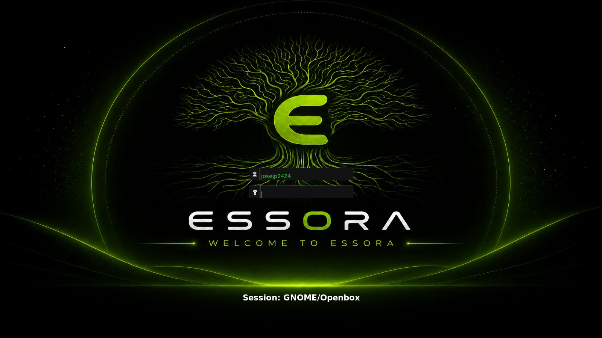
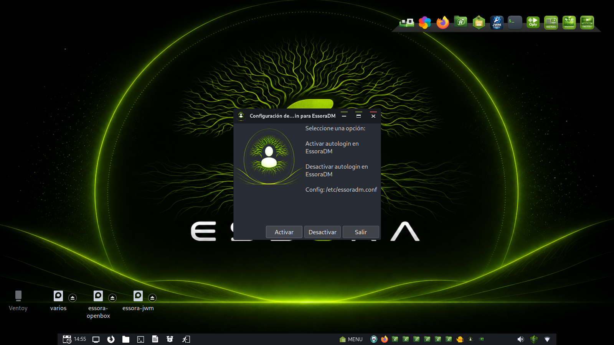

# EssoraDM

[](LICENSE)
[](https://github.com/josejp2424/EssoraDM/releases)
[]()
[]()
[]()
[]()



**Version:** 1.0-2

EssoraDM is a lightweight display manager for Essora Linux, originally based on Slim and expanded with Essora branding, custom startup hooks, autologin tools, optional boot splash support, and deeper Essora-init integration.

EssoraDM is not only a renamed Slim fork. It adds Essora-specific functionality such as automatic user configuration, Essora-init service integration, boot splash support, custom hooks, theme integration, and a clean lightweight login experience designed for Essora environments.

---

## Screenshots

### EssoraDM Login Screen


### Autologin Configuration Tool



---

## Features

- Lightweight and fast display manager
- Essora branding and theme integration
- Native Essora-init integration
- Optional boot splash support
- EssoraDM autologin configuration tool
- Customizable startup hooks
- Automatic user configuration
- Autologin support
- Session selection support
- PAM authentication support
- Low resource usage
- Designed for lightweight desktop environments
- Compatible with Essora-init and OpenRC-based systems
- Modernized build and packaging scripts

---

## EssoraDM Hooks

EssoraDM provides startup hooks for customization:

```text
/etc/essoradm/pre-start
/etc/essoradm/pre-login
```

These hooks can be used to:

- Show the Essora boot splash
- Start custom services
- Configure session variables
- Run scripts before the login screen appears

---

## Essora Boot Splash Integration

EssoraDM optionally supports Essora-init boot splash integration.

Included components:

```text
/usr/local/bin/essora-splash
/usr/share/essora-init/splash/essora-boot.png
/etc/essora-init.d/essora-splash
```

Boot sequence example:

```text
Kernel
→ Essora-init
→ Essora Splash
→ EssoraDM
→ Login
→ Desktop
```

---

## Autologin Tool

EssoraDM includes a graphical autologin configuration tool for enabling or disabling automatic login.

Installed components:

```text
/usr/local/bin/autologin-essoradm.sh
/usr/local/autologin/user.svg
/usr/share/applications/autologin-essoradm.desktop
```

The tool modifies:

```text
/etc/essoradm.conf
```

When autologin is disabled, it sets:

```text
auto_login          no
```

---

## Build Dependencies

Install dependencies on Devuan/Debian:

```bash
sudo apt install build-essential cmake pkg-config \
libx11-dev libxft-dev libxrender-dev \
libxrandr-dev libxmu-dev libfreetype6-dev \
libjpeg-dev libpng-dev zlib1g-dev \
libpam0g-dev libcrypt-dev
```

---

## Building

Compile EssoraDM:

```bash
./build-essoradm.sh
```

Create the Debian package:

```bash
cd essoradm_1.0-2_amd64
./create-package.sh
```

---

## Installation

Install the generated package:

```bash
sudo dpkg -i essoradm_1.0-2_amd64.deb
```

After installation, EssoraDM configures:

```text
/etc/essoradm.conf
/etc/essoradm/pre-start
/etc/essoradm/pre-login
/etc/essora-init.d/essoradm
/etc/X11/default-display-manager
```

---

## License

EssoraDM is derived from Slim Display Manager.

Original Slim authors and contributors retain copyright for upstream code.

EssoraDM modifications and integration:

```text
Copyright (C) 2026 josejp2424
```

License:

```text
GNU General Public License v2.0
```
